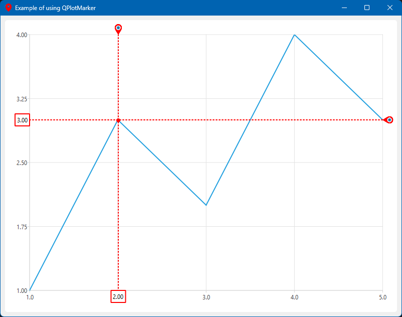
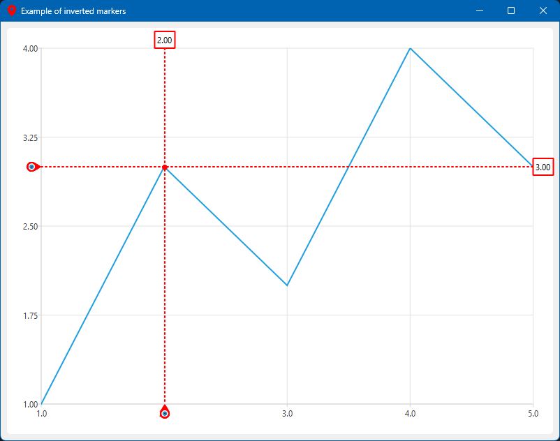
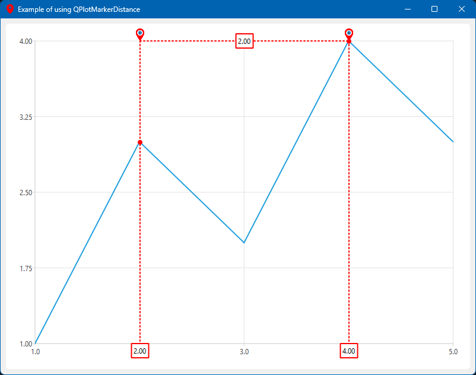
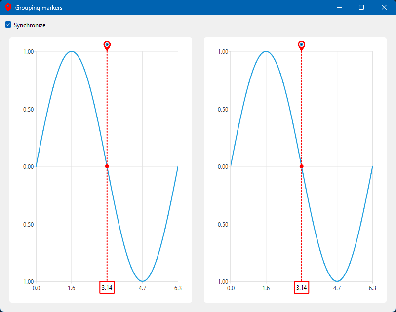

# QPlotMarker

<p align="center">
  
</p>

**QPlotMarker** – an interactive marker for **QChart** (Qt). Supports color and
orientation (vertical/horizontal) changes, snaps to data points, and displays
intersection coordinates.

## 🛠 Technology used:

[](https://isocpp.org/)
[](https://cmake.org/)
[](https://qt.io)
[](https://doc.qt.io/qt-6/qtsvg-index.html)
[](https://doc.qt.io/qt-6/qtcharts-index.html)
[](https://doc.qt.io/qtdoc/)
[](https://doc.qt.io/qt-6/qthelp-framework.html)

[](https://jetbrains.com/clion)
[](https://learn.microsoft.com/en-us/windows-server/administration/windows-commands/windows-commands)
[](https://git-scm.com/)
[](https://github.com/)

# ⬇️ Install

You must have
installed [project dependencies](https://github.com/Mark194/qplotmarker#dependencies)

```bash
# Clone repository

git clone https://github.com/Mark194/qplotmarker

# Go to directory

cd qplotmarker

# Create and go to the build directory

mkdir build

cd build

# Project configuration via CMake

cmake ..

# If you need to specify a specific generator, use

cmake -G "Visual Studio 17 2022" ..

# If you want to configure the library as static, add the option

-DBUILD_SHARED_LIBS=OFF

# Build project

cmake --build .

# Installing the library into the system

cmake --install .

# By default, installation goes to /usr/local/ on Linux/macOS or C:\ProgramFiles (x86)\ on Windows. To change the path, specify

-DCMAKE_INSTALL_PREFIX=/your/path 
```

[Library releases]: https://github.com/Mark194/qplotmarker/releases

<!--Integration-->

# 🧩 Integration

## 🔧 QMake Integration

```makefile

# Add include path

INCLUDEPATH += $$PWD/thirdparty/qplotmarker/include

# Link static library

LIBS += -L$$PWD/thirdparty/qplotmarker/lib -lqplotmarker

# OR compile sources directly (if needed)

SOURCES += $$PWD/thirdparty/qplotmarker/src/*.cpp
HEADERS += $$PWD/thirdparty/qplotmarker/include/*.h

```

## 🧱 CMake Integration

### Method 1: Using find_package (Recommended if installed system-wide)

```cmake

find_package(qplotmarker REQUIRED)

target_link_libraries(your_target PRIVATE qplotmarker::qplotmarker)
```

### Method 2: Manual configuration (For custom locations)

```cmake
# For header files

target_include_directories(your_target PRIVATE
        path/to/qplotmarker/include
)

# For static library
target_link_libraries(your_target PRIVATE
        path/to/qplotmarker/lib/libqplotmarker.a
)

# Or for shared library
target_link_libraries(your_target PRIVATE
        path/to/qplotmarker/lib/libqplotmarker.so)
```

### Method 3: Using FetchContent (For direct GitHub integration)

```cmake
include(FetchContent)
FetchContent_Declare(
        qplotmarker
        GIT_REPOSITORY https://github.com/Mark194/qplotmarker.git
        GIT_TAG v1.0.0
)
FetchContent_MakeAvailable(qplotmarker)
target_link_libraries(your_target PRIVATE qplotmarker)
```

<!--Support-->

# 🆘 Support

If you have any difficulties or questions about using the package, create a
[discussion](https://github.com/Mark194/qplotmarker/issues/new/choose) in this
repository or write to email


<!--dependencies-->

# 📦 Dependencies

- **Qt Core**: Version **5.15.2+** or **6.4.2+**
- **Required Modules**:
    - `QtCharts` (for plotting functionality)
    - `QtSvg` (for SVG support)
- **Compiler**:
    - Qt5: GCC 7+, Clang 6+, MSVC 2017 (v19.16+)
    - Qt6: GCC 9+, Clang 10+, MSVC 2019 (v19.28+)
- **Additional Notes**:
    - On Windows: MSVC is recommended (MinGW may have issues with QtCharts)
    - On macOS: Xcode 12+ required for Qt6
    - On Linux: Install `libgl1-mesa-dev` and other development tools

Found compatibility issues? Please report
in [Issues](https://github.com/Mark194/qplotmarker/issues).


<!--examples-->

# 💻 Examples

Ready-to-use code examples are available in
the [examples](https://github.com/Mark194/qplotmarker/tree/main/examples)
folder. These demonstrate:

- Basic usage of plotting functionality
- Advanced marker customization
- Integration with Qt widgets

## 👁️ Visual Examples

| Miniature                                                                                                                                            | Description                                                                  |
|------------------------------------------------------------------------------------------------------------------------------------------------------|------------------------------------------------------------------------------|
| <details><summary></summary></details>                 | **Base Example**<br>                                                         |
| <details><summary></summary></details>         | **Inverted Markers**<br>Invert horizontal and vertical marker                |
| <details><summary></summary></details> | **PlotMarker Distance**<br>Coord difference between markers                  |
| <details><summary></summary></details>       | **Show Coord Marker**<br>Displays the coordinates of the intersection points |
| <details><summary></summary></details>         | **Grouping Markers**<br>Grouping markers for synchronous movement            |

<!--special thanks-->

# 🙏 Special Thanks

We would like to express our special gratitude to *
*[ShonZelno](https://github.com/ShonZelno)** for their valuable contributions to
this project, including:

- Active participation in development and testing
- Suggesting innovative ideas and improvements
- Helping to identify and fix critical issues

Your involvement made this library significantly better! 
